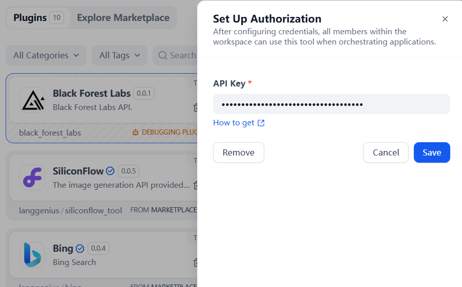
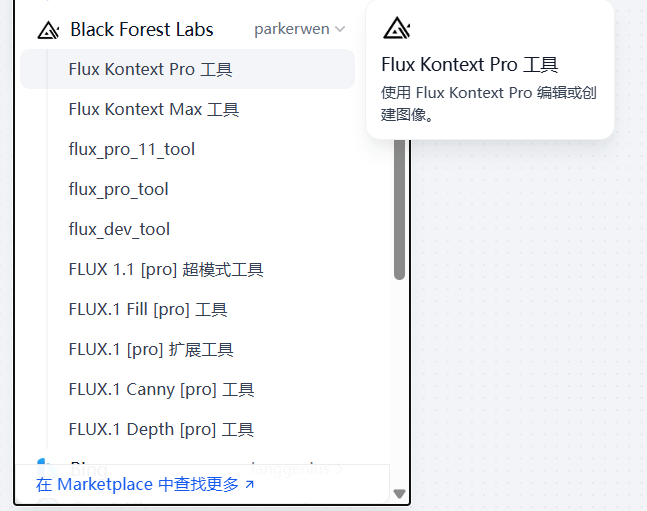
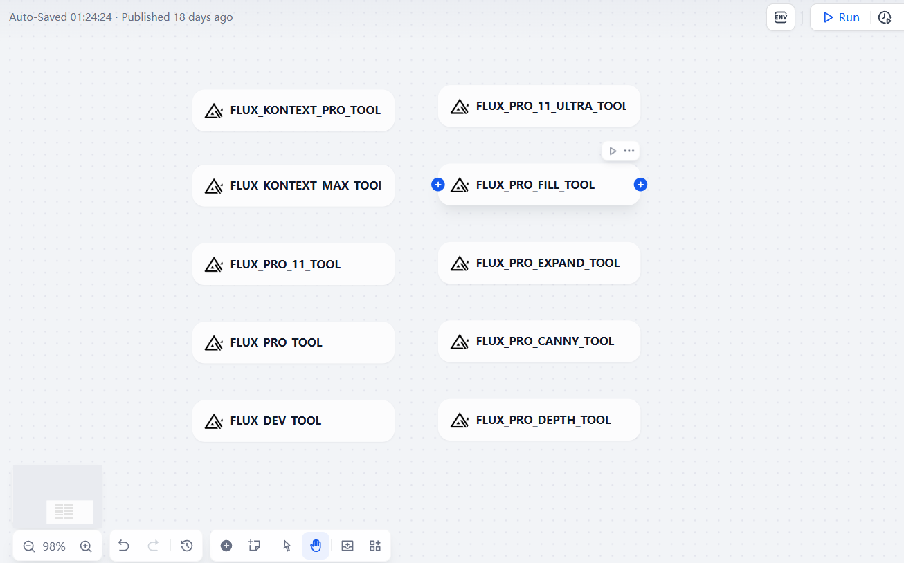

## Black Forest Labs

## Overview

[Black Forest Labs](https://bfl.ai/) builds state-of-the-art generative AI models.Our FLUX models offer state-of-the-art performance in media generation with top-of-the-line prompt following, visual quality, details and output diversity.Our latest model, FLUX.1 Kontext, combines text-to-image generation with advanced image editing capabilities. Test it in our playground or read our editing guide.

## Configuration
### 1. Apply for Black Forest Labs API Key

Please apply for an API Key on the [Black Forest Labs Dashboard](https://dashboard.bfl.ai/api/keys).

### 2. Get Black Forest Labs tool from Plugin Marketplace

The Black Forest Labs tool could be found at the Plugin Marketplace, please install it first.

### 3. Fill in the configuration in Dify

On the Dify navigation page, click Tools > Black Forest Labs > Authorize to fill in the API Key.

### 4. Use the tool

You can use the Black Forest Labs tool in the following application types.

#### Chatflow / Workflow applications

Both Chatflow and Workflow applications support adding Black Forest Labs tool nodes.

## Nodes

### flux_kontext_pro_tool

Edit or create an image with Flux Kontext Pro.

### flux_kontext_max_tool

Edit or create an image with Flux Kontext Max.

### flux_pro_11_tool

Submits an image generation task with the FLUX 1.1 [pro].

### flux_pro_tool

Submits an image generation task with the FLUX.1 [pro].

### flux_dev_tool

Submits an image generation task with FLUX.1 [dev].

### flux_pro_11_ultra_tool

Generate an image with FLUX 1.1 [pro] with ultra mode and optional raw mode..

### flux_pro_fill_tool

Generate an image with FLUX.1 Fill [pro] using an input image and mask.

### flux_pro_expand_tool

Expand an image by adding pixels on any side.

### flux_pro_canny_tool

Generate an image with FLUX.1 Canny [pro] using a control image.

### flux_pro_depth_tool

Generate an image with FLUX.1 Depth [pro] using a control image.

